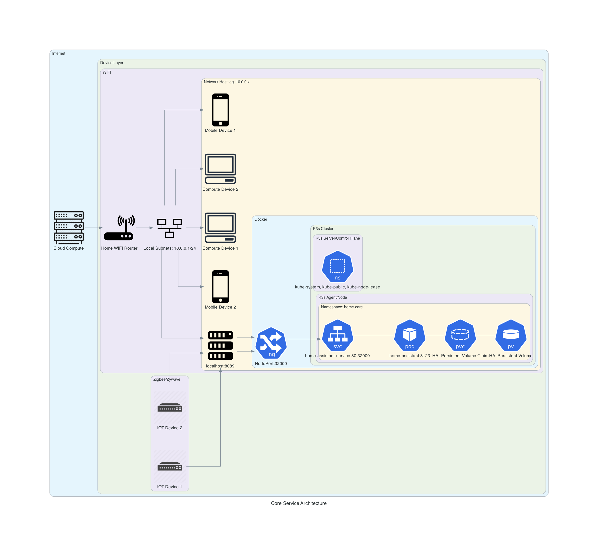

# swamp-labs

1. Home Automation brain - In Progress
1. Robotic Control Systems - To Do
1. Edge Device Fabrication - To Do
1. Edge Device Integration - To Do

## Docs

1. [Proposed Architecture](docs/ARCHITECTURE.md)
1. [Project](docs/PROJECT.md)

## Current Architecture

__Figure 1: K3S/docker single host architecture__




## Usage

### Requirements
OSX is only currently supported install path.

Make sure Docker OSX is installed.

`docker-compose` is managing the configuration of the K3S cluster

- brew install docker-compose
- brew install kubectl

### Deploy the cluster


```
docker-compose up
```

### Update kubectl

```
export KUBECONFIG=./output/kubeconfig.yaml
```

### Create core services

```
make
```

### Check status

```
make status
```


### Delete core services

```
make delete
```

### Teardown the Cluster

```
docker-compose down -v # destroys volumes
```

### Access Home-Assistant

Visit localhost:8089

